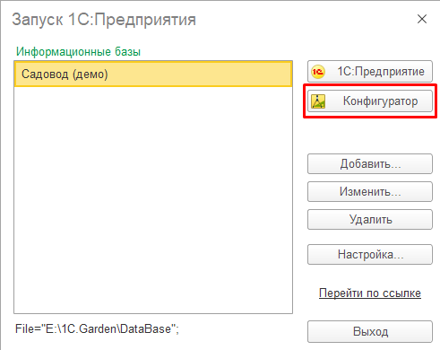
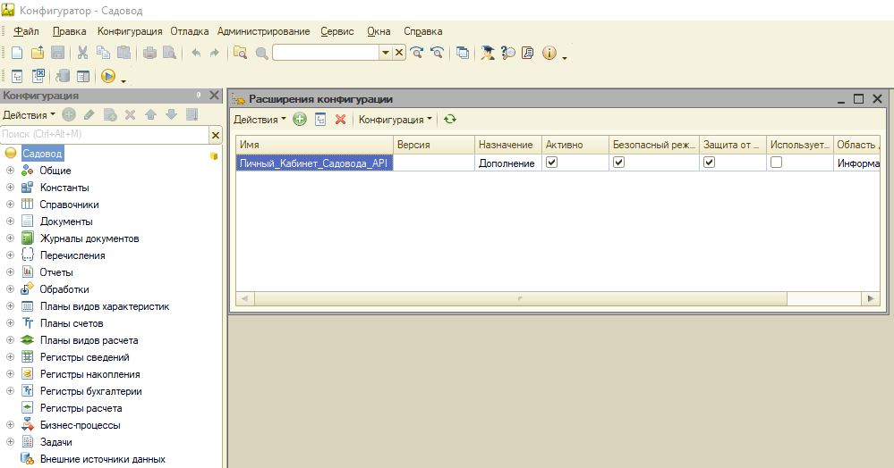
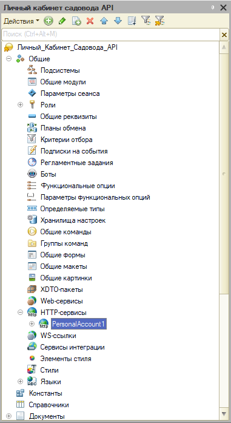
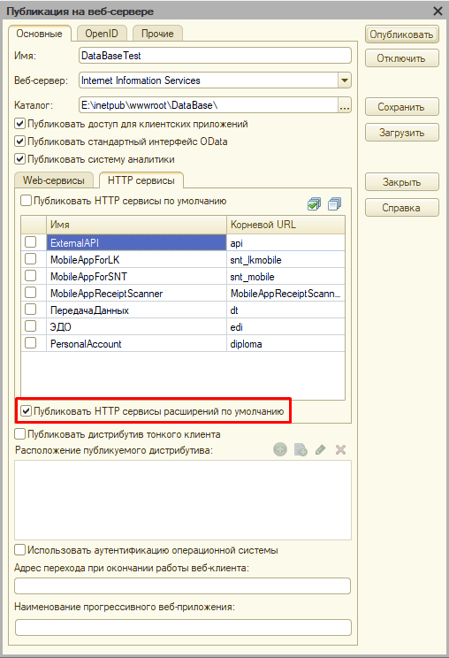

# Gardener-s-Personal-Account-Server

Description of the project in another language: [Русский](README.md)

In the folder, you can find the [ServerPersonalAccount](ServerPersonalAccount.txt) file, which contains the text version of the server.

Also in the folder you can find the [Personal_Account_Gardener_API](Personal_Account_Gardener_API.cfe) file, which is an extension of the 1C configuration

## How to connect the extension:

1. You need to run 1C in configuration mode:

2. Select an administrator profile (if desired and for convenience, create a new profile to interact with your personal account):

3. When opening the configuration in the configuration extension setting in the menu: "Configuration -> Configuration extensions":

4. Upload the configuration file by selecting: "Configuration -> Load configuration from file"
5. After downloading, the configuration itself will open:

## How to publish an extension on the server:

1. Open the "Publish to Web Server" menu: "Administration -> Publish to Web Server"
2. Then, in the HTTP services menu, check the box "Publish HTTP extension services by default":

3. It remains to click on the "Publish" button, after which you can start interacting with the service
